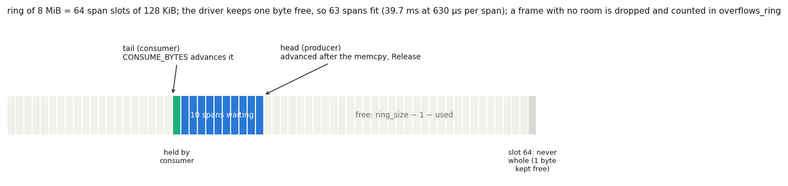
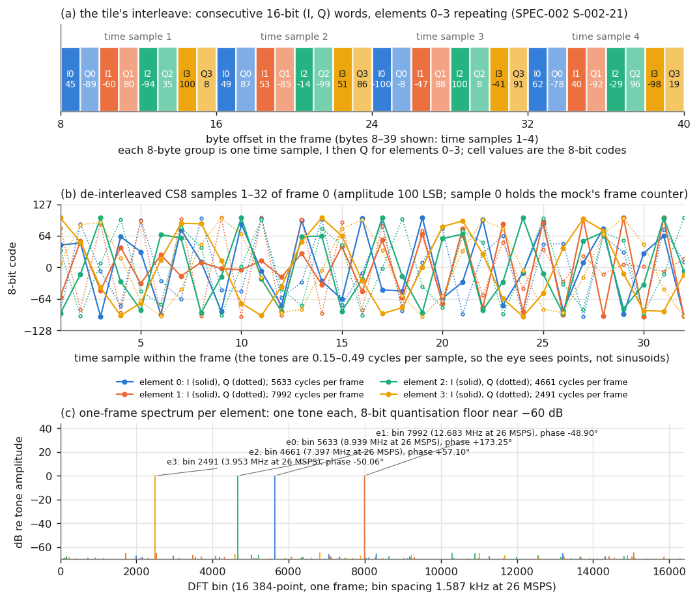
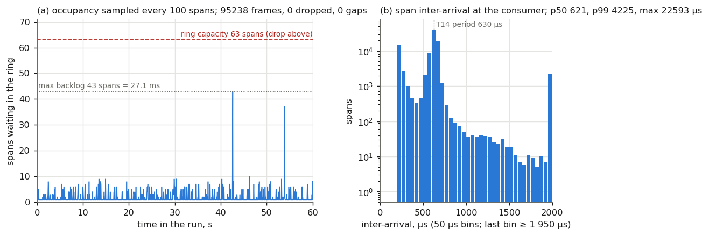
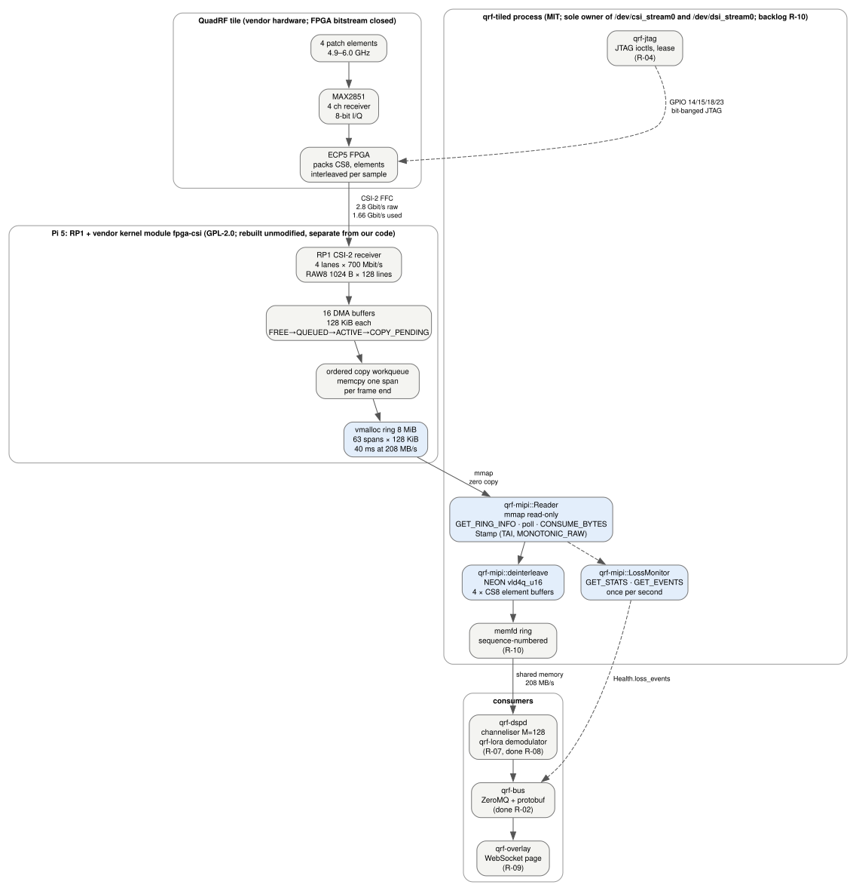
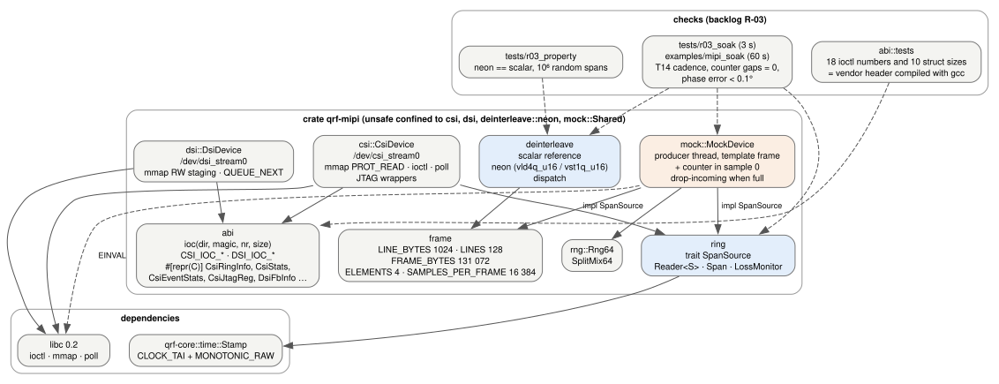

# LR-009 — `qrf-mipi`: the receive-ring ABI in Rust, the NEON de-interleave, and a mock tile that holds the T14 cadence (backlog R-03)

*Lab report. 2026-10-08.*

<!-- SPDX-License-Identifier: MIT -->

| Field | Value |
| --- | --- |
| Status | Final |
| Author | project (crate `crates/qrf-mipi`, this VM) |
| Feeds | `backlog.md` R-03 (done), P-03 and R-10 (checks extended, §VI); `crates/README.md`; `docs/resources-manifest.md` (`resources/measurements/R-03/`); SPEC-002 U-002-3 (values derived from source, bench confirmation left to R-03b) |

## Abstract

`qrf-mipi` is the crate through which `qrf-tiled` (backlog R-10) will own the
tile's two device nodes. Its ioctl numbers and argument layouts were derived
from the direction, magic, sequence number and size that the Linux encoding
takes, and checked against the vendor header compiled with the system C
compiler: 18 request numbers and 10 structure sizes agree. The receive ring is
read zero-copy through a `SpanSource` contract that the kernel node and a mock
device both meet, so every consumer is written once. The de-interleave into
four per-element CS8 buffers has a scalar reference and a NEON kernel; they
agree on 10⁶ random spans, and the NEON kernel moves 40.6 GB/s against the
scalar 3.2 GB/s, 0.5 % of a core at the T14 rate. The mock synthesises frames
in the tile's layout from a seed and paced them at one 131 072-byte frame per
630 µs (208.0 MB/s) for 60 s on this VM: 95 238 frames, none dropped, no
frame-counter gap, every element's phase within 0.003° of the injected one,
with the consumer at 0.36 core, most of it the phase check. Two facts came
out of reading the driver for the ABI and are recommended into the backlog:
the ring is 512 pages, so a 4 KiB-page kernel (copal's, unless configured
otherwise) gives 2 MiB and 9.5 ms of buffering instead of the vendor image's
8 MiB and 40 ms; and the `drop_oldest=1` policy moves the consumer's tail
under a mapped span, so `qrf-tiled` must refuse it.

## I. Objective

1. Bind the receive and transmit nodes' ABI (SPEC-002 S-002-14…17) in Rust without copying the GPL-2.0 header: numbers derived, then verified against it.
2. De-interleave the tile's layout (S-002-21) to per-element CS8 with a NEON leaf kernel that provably equals a scalar reference (SPEC-008 S-008-5).
3. Provide a mock of the node that produces frames in the vendor layout at the T14 cadence, so that the capture path, its budgets and later `qrf-tiled` can be tested on a machine without the tile; show it sustains 208 MB/s through a consumer for 60 s without loss.
4. Stamp and account for loss as S-008-2/3 require, so that R-10 inherits the mechanism.

## II. Materials

| Item | Detail |
| --- | --- |
| Vendor sources | `resources/repos/quadrf-open-space-sdr` at `8b61ae5` (manifest row): `sources/fpga/drivers/csi/fpga_csi.h`, `fpga-csi.c`, `drivers/dsi/fpga-dsi.c`, read for the public ioctl/mmap interface only (`vendor/scalerf/ATTRIBUTION.md`) |
| ABI reference | a 40-line C program (scratch, not committed) including the vendor header, compiled with gcc on this VM (aarch64), printing every `CSI_IOC_*`/`DSI_IOC_*` value and `sizeof` of every argument struct; its output is the table in `crates/qrf-mipi/src/abi.rs` `tests::REFERENCE` |
| Toolchain | Rust 1.98.1 (`rust-toolchain.toml`), release profile; `libc` 0.2.190, `qrf-core` (`Stamp`), `serde`/`serde_json` for the record |
| Machine | this VM: aarch64, 4 cores, Alpine under UTM/QEMU on a Mac host; not a proxy for the Pi 5's A76 (LR-007 §IV) |
| Analysis | `analysis/linkbudget.py` T14 (frame 131 072 B; 630 µs per frame at 4 ch × 26 MSPS; 208 MB/s; 16 DMA buffers = 10.1 ms) |
| Record | `resources/measurements/R-03/mipi-soak-60s.json` (sha256 `5ba0f8f2…`), `frame0.cs8` (sha256 `4ebede0c…`), written by `make mipi-check` |
| Figures | `lab/figures/LR-009/` from `make figures` (`analysis/plot-lr009.py`, graphviz `dot` on the `.dot` sources) |

## III. Method

1. The ioctl encoding was written from the Linux generic layout (8 bits number, 8 bits type, 14 bits size, 2 bits direction) as `const fn`s; each request is `ior::<T>(magic, nr)` or its variants, so the number follows from the Rust struct's size. The argument structs were written `#[repr(C)]` from the fields S-002-14…17 name, padding explicit. The compiled reference program then settled every number and size; the test asserts them and four offsets inside `CsiStats`. `[M]`
2. `SpanSource` states the ring protocol the driver implements: the producer writes only at and beyond `head`; `[tail, head)` is stable until the consumer advances `tail`; positions are byte offsets modulo the ring size. `Reader<S>` delivers one `Span` at a time (a borrowed slice of the mapping; a copy only when a span straddles the end, which cannot happen when the span divides the ring), stamps it with `qrf_core::time::Stamp` on arrival, and consumes it on the next call. `LossMonitor` differences `CsiStats`/`CsiEventStats` snapshots and reports any increase with the span sequence number (S-008-3). `[D]`
3. `deinterleave_scalar` copies byte by byte in the order S-002-21 states; `deinterleave_neon` loads eight time samples (64 bytes) with a four-way interleaved 16-bit load and stores each lane to its element; `deinterleave` dispatches. `tests/r03_property.rs` generates 10⁶ spans of 0–256 samples of random bytes at random source alignments 0–7 and asserts equality. `[M]`
4. `MockDevice` holds a ring of the driver's geometry in memory and a producer thread that writes a template frame at each schedule point `t₀ + n·630 µs` (sleep to 300 µs before, then spin), advances `head` with a Release store, and drops the frame with `overflows_ring += 1` when fewer than a span's bytes are free, as the driver does by default. The template is four tones, one per element, at seeded bins (whole cycles per frame, so every frame is identical and the phase at sample 0 equals the seeded phase) and seeded phases, amplitude 100 LSB; time sample 0 of each frame carries a 64-bit frame counter so that a consumer can prove continuity. `[D]`
5. `examples/mipi_soak.rs` (`make mipi-check`) runs the mock for 60 s through `Reader`, `deinterleave` and a single-bin DFT per element per frame (a phase recurrence, no trigonometric call per sample), records inter-arrival and service times, ring occupancy every 100 spans, counter gaps, the loss monitor once per second, the consumer thread's and the process's CPU time, and benchmarks both kernels on one frame in cache. `tests/r03_soak.rs` is the same for 3 s inside `cargo test`. `[M]`
6. The driver source was read, beyond the header, for three facts the bindings depend on: the ring positions are masked with `size − 1` (power of two), the ring holds `size − 1` bytes, and spans are copied whole with a wrap; and for the two policies in §IV.D. `[S]`

## IV. Results

### A. The ABI

- 18 request numbers and 10 argument sizes equal the compiled header's (`abi::tests`): for example `CSI_IOC_GET_RING_INFO` = `0x80104340` (`_IOR('C', 0x40, 16 bytes)`), `CSI_IOC_CONSUME_BYTES` = `0x40044341`, `CSI_IOC_GET_STATS` = `0x80804302` (128 bytes), `CSI_IOC_GET_EVENTS` = `0x80384307` (56 bytes), `CSI_IOC_JTAG_REG_READ` = `0xc0064313` (6 bytes), `DSI_IOC_GET_FB_INFO` = `0x80204410` (32 bytes). `[M]`
- Ring geometry from the driver (U-002-3, by source; the bench reads it back in R-03b): the ring is `1 << 9` = 512 pages allocated with `vmalloc_user`, so 8 MiB on the vendor kernel's 16 KiB pages and 2 MiB on a 4 KiB-page kernel; the span is the device-tree frame, 1024 × 128 = 131 072 B; positions are masked with `size − 1` and one byte is kept free, so 63 spans (39.7 ms at 630 µs) fit in 8 MiB and 15 spans (9.5 ms) in 2 MiB. `[S]` (`fpga-csi.c` `RING_ORDER`, `r_space`, `push_dma_to_ring`; `fpga-csi.dts`)
- The `DsiFbInfo` layout has six fields (bytes per frame, count, head, tail, queued, pad), 32 bytes with the trailing pad; S-002-17 lists only the first two. `[S]`

### B. De-interleave

- `neon == scalar` on 1 000 000 random spans, 1 024 556 384 bytes, all alignments 0–7 and all remainders 0–7 samples (`tests/r03_property.rs`, 1.1 s in release). `[M]`
- Throughput on one 131 072-byte frame in cache, this VM: scalar 3.25 GB/s, NEON 40.65 GB/s (12.5×). At the T14 rate (208 MB/s) the NEON kernel costs 0.5 % of a core and the scalar 6.4 %. The in-cache figure is an upper bound; the Pi 5 number with the span arriving from the kernel's copy is R-07/P-05's to measure. `[M]`+`[D]`

### C. The mock at the T14 cadence for 60 s

`make mipi-check`, 2026-10-08, this VM, otherwise idle. `[M]` (`resources/measurements/R-03/mipi-soak-60s.json`)

| Quantity | Value |
| --- | --- |
| Frames produced / consumed / dropped | 95 238 / 95 238 / 0 |
| Frame-counter gaps; loss events (S-008-3 monitor, once per second) | 0; 0 |
| Throughput | 208.0 MB/s over 60.00 s |
| Ring occupancy: p99 of the 952 samples; maximum | 8 spans; 43 of 63 spans (27 ms) |
| Span inter-arrival at the consumer, µs: min / p50 / p99 / p99.9 / max | 206 / 621 / 4 225 / 4 998 / 22 593 |
| Consumer service per span, µs (de-interleave + 4 single-bin DFTs): p50 / p99 / max | 216 / 589 / 18 943 |
| Producer late by more than one period: frames; worst | 9 838 of 95 238 (10 %); 17.0 ms |
| Phase error, all four elements, every frame: worst / mean | 0.0028° / 0.0008° |
| CPU: consumer thread / whole process (producer thread spins up to 300 µs per frame) | 0.36 / 0.76 core |

- The R-03 criterion is met: the T14 cadence through the consumer for 60 s with no skipped frame counter, and the de-interleaved tones return the injected per-element phases within 0.1° (worst 0.0028°). `[M]`
- The consumer's 216 µs median is the phase check (4 × 16 383 complex multiply-adds in f64); the de-interleave itself is 3.2 µs of it (§B). A consumer that only de-interleaves and hands the buffers on would be near 0.01 core on this machine. `[M]`+`[D]`
- The tails are the VM, not the code: 2 291 spans (2.4 %) arrived ≥ 1.95 ms after the previous one, and both the producer's worst lateness (17 ms) and the consumer's worst service time (19 ms) are of the size of a hypervisor or host-scheduler stall. The ring absorbed the worst stall at 43 spans; the 8 MiB ring leaves 2.3× margin against it on this VM. On the Pi 5 the equivalent figure is the consumer wake-to-consume budget of LR-003 §IV.C (< 10 ms, target < 2 ms), measured in P-05/R-10, and the smaller 2 MiB ring of §A would have overflowed here (15 spans). `[M]`+`[D]`
- Inter-arrival below the period (minimum 206 µs) is the consumer catching up after a stall: spans already in the ring are delivered back to back. `[D]`

*Figure 1. The ring protocol restated: 64 slots of 128 KiB, one byte kept free so 63 spans fit; the consumer holds one span (green) while `head` runs ahead; a frame with no room is dropped and counted, never written over the consumer. `[D]`*

*Figure 2. Frame 0 of the 60-s run. (a) The byte layout: each 8-byte group is one time sample, I then Q for elements 0–3 (S-002-21). (b) The first 32 samples of each element after `deinterleave`. (c) The one-frame spectrum per element: one tone each at its seeded bin, the 8-bit quantisation floor near −60 dB re the tone. `[M]`*

*Figure 3. (a) Spans waiting in the ring, sampled every 100 spans: usually 0–8, two stalls to 43 and 37 spans, capacity 63. (b) The inter-arrival histogram: the mode at the 630 µs period, a catch-up population below it, a stall tail above 2 ms (last bin). `[M]`*

### D. Two facts from the driver that constrain `qrf-tiled`

- `drop_oldest=1` frees "at least one span and normally half the ring" by moving `tail` forward under the kernel lock, without regard to what userspace is reading through the mapping; a consumer holding a span would see it overwritten. The default `drop_oldest=0` drops the incoming span instead and counts it in `overflows_ring`. `[S]` (`fpga-csi.c` `push_dma_to_ring`)
- The ring size follows the page size (§A). The vendor image (Debian, `linux-headers-rpi-2712`) runs 16 KiB pages; copal's `linux-rpi` page size is not recorded in this repository. `[S]`+`[C]` (closes with `getconf PAGESIZE` on copal, P-03)

## V. Discussion

The ABI work is small and now mechanical: a request number is a function of four facts, and a C compiler against the header is the oracle. The same method will serve `qrf-jtag` (R-04), whose ioctls are already bound here. What is not verified on this machine is the kernel path itself (`CsiDevice`, `DsiDevice`): `open`, `mmap`, `poll` and the ioctls are written against the ABI and the driver's semantics as read, and remain `[C]` until P-03 produces the nodes. The mock is faithful in geometry, pacing, layout and the default drop policy, and unfaithful in two ways that matter for budgets: its producer is a thread, not DMA plus a copy workqueue, so it loads the same cores as the consumer (the 0.40 core of producer time in the process figure is the mock's cost, not the system's), and its frames are identical, so a cache-friendly consumer is favoured. R-03b replays a recording of the real ring and removes both.

The soak's stall statistics say more about the VM than about the design, but they say one useful thing about the design: a 40 ms ring is comfortable and a 9.5 ms ring is not, on a machine that stalls for 20 ms. The page-size dependence of the ring therefore moves from a curiosity to a P-03 check, and if copal runs 4 KiB pages the options are a `RING_ORDER` patch to the module (published, P-03's check already allows "any patch") or a 16 KiB-page kernel.

What would refute this report's claims: a Pi 5 run of the same soak with a consumer wake latency that exceeds the ring, which would mean the budget belongs in the kernel (LR-003 §V); or a `CSI_IOC_GET_RING_INFO` at the bench returning a span other than 131 072 bytes, which would mean the device tree in `resources/` is not the one the FPGA drives.

## VI. Recommendations and best practice

1. Backlog R-03 is done; `make mipi-check` is its 60-s check and `tests/r03_soak.rs` its 3-s standing check in `make check`. Applied.
2. R-10: `qrf-tiled` reads `/sys/module/fpga_csi/parameters/drop_oldest` at start and refuses to run when it is `1` (§IV.D); its ring consumer runs on a thread with `SCHED_FIFO` when permitted, and its wake-to-consume histogram is the one the mock records here. Added to the R-10 check.
3. P-03: record copal's page size and the ring size `CSI_IOC_GET_RING_INFO` returns; if the ring is 2 MiB, decide between a `RING_ORDER` patch and a 16 KiB-page kernel before P-05. Added to the P-03 check.
4. R-03b, as written: replay a recording of the real ring through `MockDevice` (a `template` from the file instead of the tones) and close U-002-3 and U-008-1 with the measured sizes.
5. Method: derive an ABI, then verify it by compiling the vendor header with the system compiler and recording the result in the test; never transcribe the header. This is now the pattern for `qrf-jtag`.

## VII. References

`specs/SPEC-002-quadrf-host-software.md` S-002-14…17, S-002-21, U-002-3; `specs/SPEC-008-system-architecture-rust.md` S-008-2/3/5, U-008-1; `analysis/linkbudget.py` T14; `lab/LR-003-rust-system-architecture.md` §IV.B–C, §V; `lab/LR-007-backlog-review-and-resequencing.md` §IV; `vendor/scalerf/ATTRIBUTION.md`; `vendor/summary/scalerf-quadrf.md`; `crates/qrf-mipi/` (`src/abi.rs`, `src/ring.rs`, `src/deinterleave.rs`, `src/mock.rs`, `tests/r03_property.rs`, `tests/r03_soak.rs`, `examples/mipi_soak.rs`); `analysis/plot-lr009.py`; `lab/figures/LR-009/` (`data-path.dot`, `crate.dot` and their SVGs, the three PNGs); `resources/repos/quadrf-open-space-sdr` (manifest row, commit `8b61ae5`); `resources/measurements/R-03/` (manifest rows).

### Architecture drawings

*Figure A. The receive data path and who owns each stage: the tile (closed bitstream), the RP1 and the vendor module (GPL-2.0, a separate kernel object), the `qrf-tiled` process (this crate's `Reader`, `deinterleave` and `LossMonitor`), and the consumers over shared memory and the bus. Rates from T14; ring geometry from §IV.A. `[D]`*

*Figure B. The crate: `abi` under the two device wrappers, `ring`'s `SpanSource` contract met by the kernel node and the mock, `deinterleave` with its scalar reference, and the three checks that close R-03. `[D]`*
