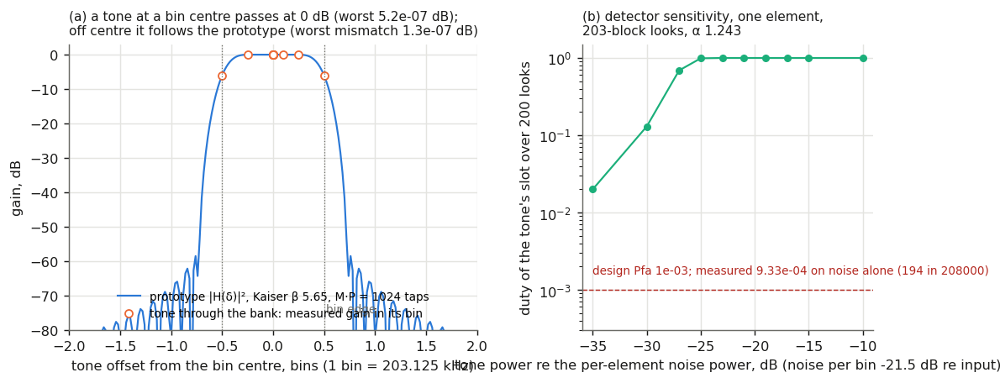
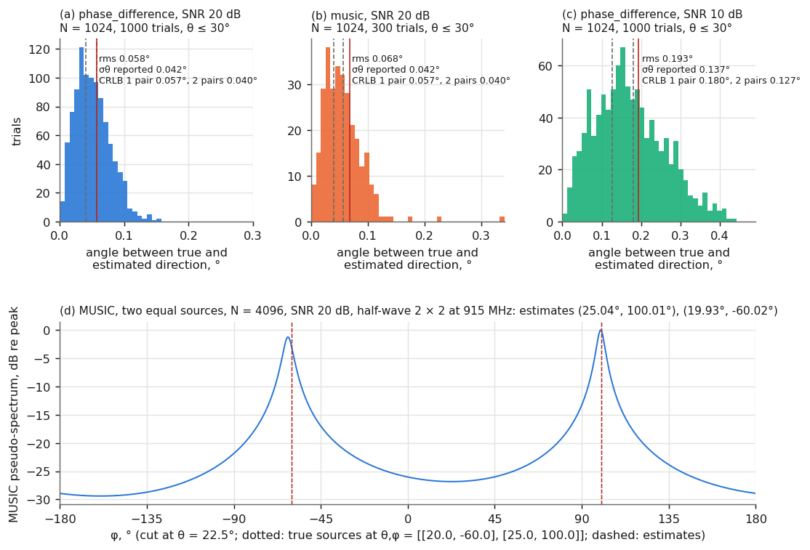
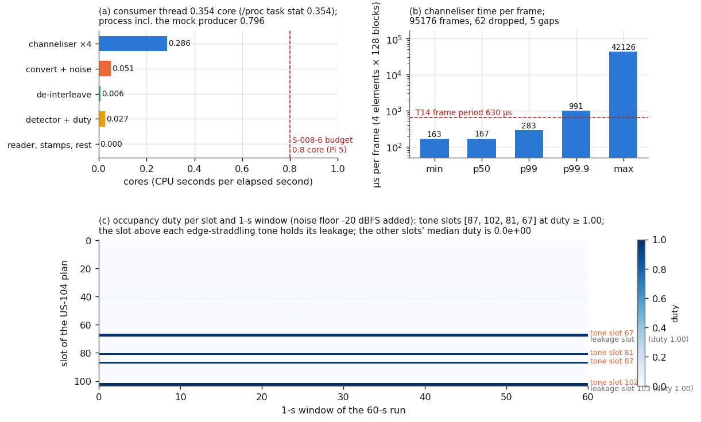
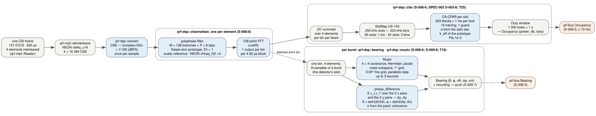

# LR-010 — `qrf-dsp`: the polyphase channeliser, the CA-CFAR occupancy detector and the two bearing estimators, checked on simulated signals and on the mock tile (backlog R-07, function half)

*Lab report. 2026-10-08.*

<!-- SPDX-License-Identifier: MIT -->

| Field | Value |
| --- | --- |
| Status | Final for the function half of R-07; the CPU budget half is open until a Pi 5 runs `make dsp-check` |
| Author | project (crate `crates/qrf-dsp`, this VM) |
| Feeds | `backlog.md` R-07 (in progress: function check passed, budget waits for a Pi 5), D-09 (the Pi 5 row); `analysis/linkbudget.py` T25 and its Rust port; `crates/README.md`; `docs/resources-manifest.md` (`resources/measurements/R-07/`); SPEC-008 S-008-6 (the slot-edge leakage, §VI.3) |

## Abstract

`qrf-dsp` is the crate `qrf-dspd` will run: a critically sampled polyphase
channeliser of M = 128 bins and P = 8 taps over the 26 MHz capture, a
cell-averaging CFAR detector over the 104 slots of the US plan with a
duty-cycle estimator, and two bearing estimators on the 2 × 2 square: summed
two-element phase differences, and MUSIC on the 4 × 4 covariance. On
simulated signals a tone at a bin centre passes at 0 dB to within 5 × 10⁻⁷ dB
and a tone off centre follows the prototype's response to within 1.3 × 10⁻⁷ dB;
the phase-difference bearing has an rms error of 0.058° and MUSIC 0.068° at
20 dB SNR and N = 1024, against the T16 one-pair bound of 0.057° and the two-axis
two-pair bound of 0.057° (T25: 0.040° per axis); the detector's false-alarm
rate on noise is 9.3 × 10⁻⁴ at a design 10⁻³, but only after the threshold was
corrected for two effects the naive formula misses, the correlation of the
bank's successive outputs (203 blocks are 196.5 independent looks) and the
spread of the training mean (the ratio law, T25). The R-03 mock tile ran
through the whole chain at the T14 cadence for 60 s: the four tones' bin
powers equal the amplitude times the prototype response within 0.002 dB,
their slots are occupied at duty 1.00, and the consumer thread used 0.354 core
of this VM, 0.286 of it the four channelisers. That figure is reference only;
R-07's budget criterion (≤ 0.8 core) is measured on a Pi 5, which is not on
the desk. Two things came out that the specifications did not state: a tone
within half a bin of a slot edge also fills the neighbouring slot's bin, so a
narrowband emitter near an edge appears in two slots; and a deterministic
floor (here the mock's quantisation spurs) is flagged by a 1 ms-averaging CFAR
whose threshold is under 1 dB, which is the replica-flagging case of G05
F.05.14 seen from the detector's side.

## I. Objective

1. Implement the channeliser S-008-6 names (M = 128, P = 8) in f32 with a scalar filter kernel and a NEON kernel that provably agree (S-008-5), and show a tone's power passes to within 0.1 dB (the R-07 function criterion).
2. Implement the per-slot energy detector with a CFAR threshold and a duty-cycle estimator, with the threshold derived rather than tuned, and show its false-alarm rate on noise equals the design value within statistical error.
3. Implement the two-element phase-difference bearing and MUSIC on the 2 × 2 square, and show their rms error at 20 dB SNR and N = 1024 is ≤ 0.1° against the T16 bound of 0.057°.
4. Run the R-03 mock tile through the whole chain for 60 s and record the CPU shares with the method the budget check names (`/proc/<pid>/stat`), so that the Pi 5 run is a one-command repeat.

## II. Materials

| Item | Detail |
| --- | --- |
| Toolchain | Rust 1.98.1 (`rust-toolchain.toml`), release profile; `num-complex` 0.4.6, `rustfft` 6.4.1 (NEON), `serde`/`serde_json` for the record; dev: `criterion` 0.7 (no default features), `libc`, `qrf-mipi` (the mock) |
| Machine | this VM: aarch64, 4 cores, Alpine under UTM/QEMU on a Mac host; not a proxy for the Pi 5's A76 (LR-007 §IV) |
| Analysis | `analysis/linkbudget.py` T9 (geometry), T14 (frame cadence), T16 (CRLB), T19 (CPU model), T25 (added by this report: bin and slot geometry, prototype, thresholds, effective looks, CRLB of the square) |
| Record | `resources/measurements/R-07/dsp-soak-60s.json` (sha256 `30fb9ff6…`), written by `make dsp-check` (`examples/dsp_soak.rs`): the function record and the 60-s run |
| Figures | `lab/figures/LR-010/` from `make figures` (`analysis/plot-lr010.py`; `dsp-chain.dot` through graphviz) |
| Signal sources | seeded SplitMix64 (`rng`), Box–Muller Gaussian noise, plane waves from `Array::plane_waves`; the R-03 `MockDevice` for the 60-s run with a seeded −20 dBFS Gaussian floor added after conversion (64 frames, cycled) because the mock's frames are noiseless |

## III. Method

1. The prototype is a Kaiser-windowed sinc of M·P = 1024 taps, cutoff fs/(2M), β = 5.653 (60 dB sidelobes), normalised to Σh = 1 (T25). The branch for input residue m holds the taps h[pM + M − 1 − m] for the block p steps back, which is the full-rate convolution evaluated once per block; an M-point FFT separates the bins. For a tone at ω = 2πk/M + δ the output in bin k is e^{jδ(nM + M − 1)}·H(δ), so the bin-centre gain is Σh = 1 and the off-centre gain is the prototype's response at the offset; the tests check both against `filter::response_db`. The filter stage is one f32 multiply-add over P rows of 2M floats; `polyphase_scalar` is the reference, `polyphase_neon` keeps four `vfmaq_f32` accumulators per pass over the rows, and the property test compares them on 2 000 random tap and history sets. `[D]`+`[M]`
2. The slot map assigns each of the 128 bins to the 250 kHz slot whose half-open width contains its centre (80 slots get one bin, 24 get two, every slot ≥ 1; T25). The detector sums |X|² per bin over 203 blocks (0.999 ms) and, per slot, averages its bins; the threshold over the mean of 16 training slots (8 each side beyond 1 guard, clipped at the band edges) is α such that P(Gamma(k)/k > α·Gamma(K)/K) = P_fa, i.e. I_{K/(K + αk)}(K, k) = P_fa with I the regularised incomplete beta function, where k is the cell's *effective* independent looks from the prototype's inter-block and inter-bin correlation ((n·b)²/Σ(n − |τ|)|ρ(dk, τ)|², T25) and K = N²/Σ(1/k_j) the training mean's Gamma shape. The false-alarm rate was measured on 2 000 looks of white Gaussian noise through one channeliser (208 000 slot-looks), and the sensitivity on a tone at the centre of slot 19's bin at ten levels. `[D]`+`[M]`
3. Array frame: elements in the x–y plane, normal +z; a direction is (θ from the normal, φ in the plane from +x); a plane wave from (θ, φ) reaches element i with phase +k r_i·u. `phase_difference` sums the cross products of the two x pairs and of the two y pairs (Δx = kd sin θ cos φ, Δy = kd sin θ sin φ), takes φ from their ratio and θ from their magnitude, estimates the SNR from the pairs' magnitude coherence γ = ρ/(1 + ρ) and reports σ_θ and σ_φ from var(Δ) = (1 + 2ρ)/(2Nρ²) halved by the pair averaging (the T16 form 1/(√(N·SNR) kd cos θ) at high SNR). `Music` takes the sample covariance, diagonalises it by cyclic Hermitian Jacobi rotations, keeps the 4 − K smallest eigenvectors, scans a 1° grid in (θ, φ), refines each local maximum on a 0.05° grid of ±1.5° and takes a parabolic step. Trials: 1 000 (300 for MUSIC) plane waves at θ uniform in 0–30°, φ uniform, N = 1 024, on a half-wave 2 × 2 at 915 MHz (T9: 164 mm, the FTFE aperture's pitch), SNR 20, 10 and 0 dB; the error is the angle between the true and estimated directions. Two equal sources at (20°, −60°) and (25°, 100°), N = 4 096, 20 dB, for MUSIC with K = 2. The mountings to S-009-5 azimuth and elevation (horizontal array, forward-facing array) are functions of `Bearing` and are tested on known cases. `[D]`+`[M]`
4. `examples/dsp_soak.rs` (`make dsp-check`) computes the function record, then runs the mock for 60 s through `Reader`, the NEON de-interleave, `cs8_to_c32` (× 1/128, dBFS), the noise floor, four channelisers, the four-element power sum, the detector (looks per block = 4) and a 1 000-look duty window; it times each stage with `Instant`, reads the consumer thread's CPU from `CLOCK_THREAD_CPUTIME_ID` and from `/proc/self/task/<tid>/stat`, the process's from `/proc/self/stat`, and benchmarks the kernels in cache. `tests/r07_soak.rs` is the 3-s form inside `cargo test`. `[M]`

## IV. Results

### A. The channeliser

- A tone at a bin centre (bins 0, 1, 17, 63, 64, 100, 127) passes with a gain of 0 dB, worst |gain| 5.2 × 10⁻⁷ dB (criterion 0.1 dB); its leakage into the neighbouring bin is below −50 dB. `[M]`
- A tone 0.1, 0.25 and 0.5 bins off centre passes at +0.0024, +0.0075 and −6.023 dB, equal to the prototype's response at those offsets within 1.3 × 10⁻⁷ dB (Figure 1a). The passband therefore has 0.0075 dB of ripple at ±¼ bin and −6.0 dB at the bin edge; a signal 250 kHz wide spans 1.23 bins and is not flat across them. `[M]`+`[D]`
- NEON and scalar filter stages agree on 2 000 random cases within P half-ulps (fused versus separate rounding); a whole channeliser with each kernel agrees on 32 blocks of noise within 4 ulp. `[M]`
- In cache on this VM: one block (128 complex samples, filter and FFT) 403 ns scalar, 312 ns NEON; four elements × one frame (16 384 samples each) 165 µs = 397 MSPS per core, where the T14 rate needs 104 MSPS. `[M]`

### B. The detector

- Thresholds (T25; `Detector::with_prototype`): an interior one-bin slot has k = 197 effective looks and a training shape K = 3 588, α = 1.243 (0.94 dB); an interior two-bin slot k = 389, α = 1.174; edge slot 0 (8 training cells) K = 1 794, α = 1.184. With the looks taken as independent and the training mean as exact the gamma tail gives 1.231; the first version of the detector used that and measured a false-alarm rate of 1.76 × 10⁻³. `[D]`+`[M]`
- With the corrected thresholds, 194 false alarms in 208 000 slot-looks: 9.33 × 10⁻⁴ at a design 10⁻³ (the 95 % interval of a Poisson count of 208 is 180–236; 194 is inside it). `[M]`
- Sensitivity, one element, 203-block looks, tone at a bin centre: duty 0.02 at −35 dB re the per-element noise power, 0.13 at −30, 0.69 at −27, 0.99 at −25, 1.00 from −23 dB up (Figure 1b). The per-bin noise is −21.5 dB re the input power (one bin of 128 plus the prototype's noise bandwidth), so the 50 % point sits about 6.5 dB above the per-bin noise, 1 ms of averaging doing the rest. `[M]`+`[D]`

*Figure 1. (a) The prototype's power response over ±2 bins (Kaiser β 5.65, 1 024 taps) with the measured gain of tones through the bank at 0, ±0.1, ±0.25 and ±0.5 bins. (b) Duty of a tone's slot against the tone's power relative to the per-element noise, with the measured false-alarm rate on noise alone. `[M]`*

### C. Bearings

| Estimator | SNR, dB | Trials | rms error | max error | mean reported σ_θ | CRLB one pair (T16) | CRLB two pairs per axis (T25) |
| --- | --- | --- | --- | --- | --- | --- | --- |
| phase difference | 20 | 1 000 | 0.058° | 0.155° | 0.042° | 0.057° | 0.040° |
| MUSIC | 20 | 300 | 0.068° | 0.365° | 0.042° | 0.057° | 0.040° |
| phase difference | 10 | 1 000 | 0.193° | 0.527° | 0.137° | 0.180° | 0.127° |
| MUSIC | 10 | 300 | 0.190° | 0.522° | 0.137° | 0.180° | 0.127° |
| phase difference | 0 | 1 000 | 0.718° | 1.686° | 0.518° | 0.570° | 0.403° |

- The R-07 criterion (rms ≤ 0.1° at 20 dB, N = 1 024) is met by both estimators. The error is a two-axis angle, so its rms is √2 × the per-axis σ: 0.057° expected from the two-pair bound, 0.058° measured; the per-axis σ the estimator reports (0.042°) matches the bound (0.040°). `[M]`+`[D]`
- At 0 dB the rms (0.718°) exceeds √2 × the reported σ (0.733° expected) by nothing and the one-pair T16 figure (0.570°) by 26 %: T16's 1/(N·SNR) form drops the (1 + 2ρ)/(2ρ²) low-SNR term that the estimator's σ keeps. `[M]`+`[D]`
- MUSIC resolves two equal sources 85° apart in φ at (19.93°, −60.02°) and (25.04°, 100.01°) (Figure 2d); it costs 3.3 ms per burst of 1 024 samples on this VM against 5 µs for the phase-difference estimator, almost all of it the 1° grid of 360 × 91 steering vectors. `[M]`

*Figure 2. (a–c) Histograms of the angle between the true and estimated directions with the rms, the reported σ_θ and the two CRLB figures marked. (d) The MUSIC pseudo-spectrum along φ at θ = 22.5° for two equal sources, with the estimates. `[M]`*

### D. The mock tile through the chain for 60 s

`make dsp-check`, 2026-10-08, this VM, otherwise idle, −20 dBFS floor added. `[M]` (`resources/measurements/R-07/dsp-soak-60s.json`)

| Quantity | Value |
| --- | --- |
| Frames produced / consumed / dropped; counter gaps; loss events | 95 238 / 95 176 / 62; 5; 2 |
| Throughput; max ring backlog | 208.0 MB/s; 61 of 63 spans |
| Span inter-arrival, µs: p50 / p99 / p99.9 / max | 630 / 769 / 4 068 / 50 319 |
| Consumer service per frame, µs: p50 / p99 / max | 220 / 363 / 42 236 |
| Channeliser per frame (4 elements × 128 blocks), µs: min / p50 / p99 / p99.9 / max | 163 / 167 / 283 / 991 / 42 126 |
| Consumer thread: thread clock / `/proc/self/task/<tid>/stat` | 0.354 / 0.354 core |
| Process (`/proc/self/stat`, includes the mock's producer thread) | 0.796 core |
| Stage shares: channelisers / convert + floor / de-interleave / detector + duty | 0.286 / 0.051 / 0.006 / 0.027 core |
| Tone bin power, measured vs amplitude × prototype response, worst of four | 0.002 dB (−2.142 vs −2.144 dBFS at +0.008 bins; −5.791 vs −5.793 dBFS at +0.461 bins) |
| Tone slots 67, 81, 87, 102: minimum duty over the 58 full windows | 1.00 |
| Slots 68 and 103: duty | 1.00 (the leakage of the tones at +0.461 and +0.438 bins into the next bin, §VI.3) |
| Other 98 slots: median duty; false alarms | 0; 2 613 in 5 684 000 slot-looks (4.6 × 10⁻⁴), 1 575 of them in slot 42 and 1 007 in slots 27, 57 and 40 |

- The channelisers cost 0.286 core on this VM for four elements at 26 MSPS, with the in-cache figure of §A (397 MSPS per core) predicting 0.26; the whole consumer thread 0.354. The T19 model for the A76 is 0.73 core at 25 % of peak; this VM's core is not the A76 and the budget criterion is decided only on the Pi 5. `[M]`+`[D]`
- Sixty-two frames were dropped in two ring overflows during stalls of 42 and 50 ms, longer than the 40 ms ring (LR-009 §IV.C saw 19 ms on the same VM); the consumer was at p99 363 µs of the 630 µs period and was not the cause. The cadence criterion is R-03's and is informative here; on the Pi it is P-05/R-10's. `[M]`
- The four tones' bin powers equal the mock's amplitude (100 LSB = −2.14 dBFS) times the prototype's response at each tone's offset from its bin centre, within 0.002 dB, which is the channeliser's gain check repeated on the mock's CS8 data through the whole chain. `[M]`
- The residual detections away from the tone and leakage slots are not uniform: slot 42 alone holds 60 % of them. The mock's template is periodic and its quantisation floor is a fixed pattern of spurs (LR-009 Figure 2c: about −60 dB re the tone in a 1.6 kHz bin, so about −40 dBFS in a 203 kHz bin at worst), and a spur a few dB under the −41.5 dBFS per-bin noise raises its slot's mean by more than the 0.94 dB threshold's margin. This is the detector doing what it is designed to do on a floor that is not noise; the real tile's floor has the −42 dBc LO replicas of T17 (F.05.14). `[M]`+`[D]`

*Figure 3. (a) The consumer thread's CPU by stage against the S-008-6 budget line that applies on the Pi 5. (b) Channeliser time per frame: the p99.9 and the maximum are the VM's stalls. (c) The occupancy strip: duty per slot per 1-s window; the four tone slots and the two leakage slots at 1.00. `[M]`*

*Figure 4. The chain from a de-interleaved frame to the feed-bus messages, with the module that owns each stage; `qrf-dspd` (R-10's sibling) assembles it. `[D]`*

## V. Discussion

The channeliser is exact where it must be and its cost on this machine is a
third of what the Pi has to spend; the open question is the A76's number, and
nothing here predicts it better than T19 does. What this report settles is
the shape of the detector, which was underdetermined by S-008-6 ("a CFAR
threshold"). A cell-averaging detector on a 1 ms look is a 1 dB threshold,
and at that level the two second-order effects that textbook CFAR formulas
drop, the bank's output correlation and the training mean's spread, each move
the false-alarm rate by tens of percent; the ratio law with the prototype's
effective looks removed the discrepancy to within counting error. The method
is general: the same two numbers (k, K) follow for any n_avg, any slot map
and any prototype, so the detector needs no tuning constant.

Two consequences for the system follow. A narrowband emitter near a slot edge
fills two slots (the bins are 203 kHz and the slots 250 kHz; a tone within
half a bin of the edge leaks −6 dB into the next bin, which may belong to the
next slot). The overlay's occupancy strip will therefore show a pair of slots
for such an emitter, and the LoRa decoder, which takes a slot's bins, is not
affected because it is handed the burst's bin. The second is the deterministic
floor: on the real tile the LO replicas of F.05.14 will be flagged exactly as
the mock's spurs were, at duty 1 in their slots, and the replica rule has to
act on the detector's output, not before it. Both go into the backlog as
notes on existing entries, not as new ones.

The bearing estimators meet the bound and report a σ that matches their own
error, so the overlay's uncertainty wedges (S-008-8) will be honest. The
limit worth stating is geometric: at half-wave pitch the two-element
difference is unambiguous over the whole hemisphere (T9) only in the sense
that no second direction gives the same pair of differences; a source at the
horizon along a pair's axis has a difference of exactly π and noise flips
its sign, so the FTFE's horizontal aperture should be mounted with its
diagonals toward the directions of most interest, or MUSIC used there (it has
no wrap, only the same grating ambiguity at exactly θ = 90°). The mock run
adds nothing to the bearing check (its four tones are on different elements)
and the real test is G05 criterion 4 at the bench (R-13).

What would refute this report: a Pi 5 run of `make dsp-check` with the
channelisers above 0.8 core (then P drops to 6, or the FFT is replaced by a
real-input trick, before M is touched); a bench tone through the tile whose
bin power deviates from the prototype's response by more than the converter's
0.1 dB (then the FPGA's packing is not what S-002-21 states); or a false-alarm
rate on the tile's own noise that is not 10⁻³ after the LO replicas are
excluded (then the floor is not white across bins and the training window
must shrink).

## VI. Recommendations and best practice

1. R-07 stays in progress with the function half done; the budget half is one command on a Pi 5 running copal (`make dsp-check`, read `channeliser_cores` and the `/proc` figures from the record), filed as an `M-nnn` record beside this one. The D-09 procurement row for a Pi 5 is the gate. Applied in `backlog.md`.
2. R-10/`qrf-dspd`: build the detector with `Detector::with_prototype`, never `Detector::new`, and declare `looks_per_block` as the number of elements summed; the thresholds then follow from T25 with no constant to tune.
3. SPEC-008 S-008-6, at its next revision: state that a slot's occupancy is computed from the bins whose centres fall in it, that a narrowband emitter within half a bin of a slot edge also raises the neighbouring slot, and that the replica rule of F.05.14 operates on the detector's slot output. Noted here; the spec is not edited by a lab report.
4. R-13 (the FTFE stream): mount the 2 × 2 aperture with its diagonals toward the arcs of most interest, because a pair's axis is its ambiguous direction at the horizon; use `Music` where φ matters most and `phase_difference` for the per-burst stream.
5. Method: derive a detector's threshold from the signal chain's actual statistics (effective looks from the prototype, the training mean's shape) and measure the false-alarm rate against a counting interval before trusting it; a 1.8× discrepancy on a "textbook" formula was the first result here.
6. `make dsp-bench` runs the criterion benchmarks; their VM numbers are not quoted in documents (LR-007 §IV), the Pi's will be.

## VII. References

`specs/SPEC-008-system-architecture-rust.md` S-008-5/6/8; `specs/SPEC-009-sensor-plugins-and-feed-bus.md` S-009-5/7/8; `specs/SPEC-003-lora-css-phy.md` S-003-8; `specs/SPEC-001-quadrf-tile.md` S-001-12/14; `specs/SPEC-007-ftfe-implementation.md` S-007-10; `investigations/G05-915mhz-translation-frontend.md` F.05.14; `analysis/linkbudget.py` T9, T14, T16, T17, T19, T25; `lab/LR-003-rust-system-architecture.md` §IV; `lab/LR-007-backlog-review-and-resequencing.md` §IV; `lab/LR-009-qrf-mipi-ring-and-mock.md` §IV.C, Figure 2; `crates/qrf-dsp/` (`src/channeliser.rs`, `src/filter.rs`, `src/cfar.rs`, `src/stat.rs`, `src/array.rs`, `src/bearing.rs`, `src/music.rs`, `tests/r07_soak.rs`, `examples/dsp_soak.rs`, `benches/dsp.rs`); `analysis/plot-lr010.py`; `lab/figures/LR-010/`; `resources/measurements/R-07/` (manifest row).
